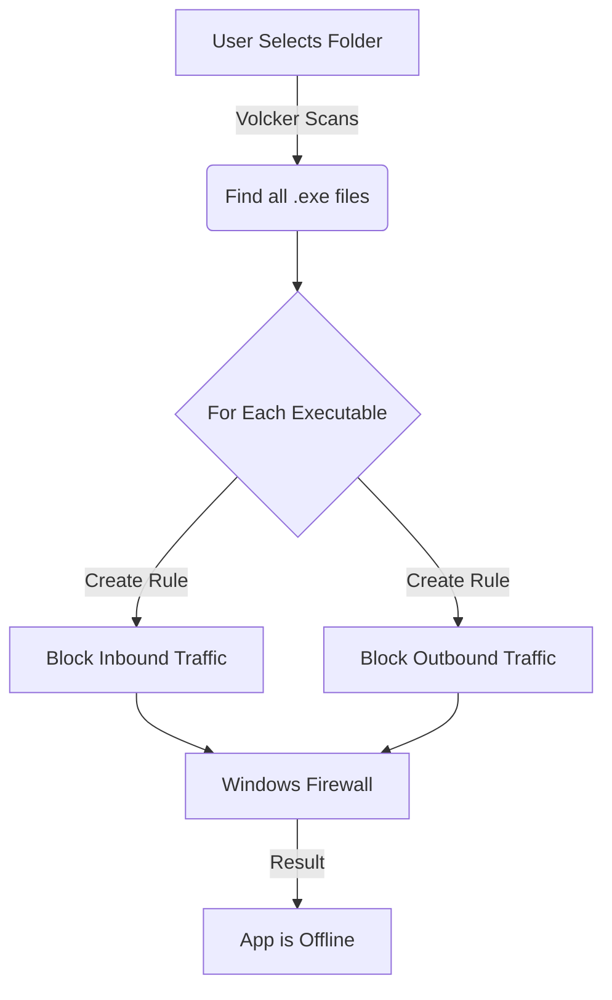

<div align="center">

# VOLCKER

[](https://www.microsoft.com/windows)
[](LICENSE)
[](https://github.com/yourusername/volcker)
[](SECURITY.md)

[**Download Latest Release**](#-installation) • [**View Source**](#-build-from-source) • [**Contribute**](#-contributing)

</div>

---

## Mission Statement

**Volcker** exists to stop softwares from forcing liscense check, telemetry, unwanted updates, give you absolute dominion over your network traffic. In an era where software constantly "phones home," consumes bandwidth, and forces updates that break your workflow, Volcker stands as the gatekeeper. We believe your software should serve **you**, not the other way around.

---

## The Problem: Why You Need Volcker

If you have an unlicensed software, it blockes all it's Exe files from checking that you don't have a valid liscense. This is a common practice for softwares to force you to buy a license. Volcker helps you to block all the traffic that the software uses to check for updates, telemetry, etc.

*   **Forced Licensing Checks**: Apps that lock you out if they can't reach a server, even for offline work.
*   **Telemetry & Tracking**: Silent data collection that monitors your usage habits.
*   **Bandwidth Vampires**: Background processes that hog your connection, causing lag in other critical tasks.
*   **Unwanted Updates**: Auto-updates that change features or break compatibility right when you need stability.

---

## The Solution: Total Network Isolation

Volcker provides a simple, powerful interface to **block all inbound and outbound traffic** for entire application directories. One click, and your software is effectively "air-gapped" from the internet while remaining fully functional on your machine.

### Perfect For:

 **Creative Suites & Design Apps**
> Adobe Creative Cloud, Affinity Suite (Designer/Photo/Publisher), CorelDRAW Graphics Suite, Autodesk Maya, Autodesk 3ds Max, Cinema 4D, Sketch, Clip Studio Paint EX, ZBrush, Serif Affinity Photo.

 **Audio Production & DAWs**
> Ableton Live Suite, FL Studio All Plugins Edition, Logic Pro, Pro Tools, Cubase Pro, Studio One Professional, Reason, Bitwig Studio, Reaper, Ableton Push-integrated Suite.

 **Enterprise Productivity**
> Microsoft Office Professional, Corel WordPerfect Office, Nitro PDF Pro, ABBYY FineReader PDF, Scrivener, Final Draft, MindManager, QuarkXPress.

 **Developer Tools**
> Visual Studio Professional, Visual Studio Enterprise, IntelliJ IDEA Ultimate, PyCharm Professional, PhpStorm, WebStorm, Rider, DataGrip, UltraEdit, Navicat Premium.

---

## Features

| Feature | Description |
| :--- | :--- |
| ** One-Click Blocking** | Instantly block internet access for an entire softawer folder of executables. |
| ** Recursive Scanning** | Automatically finds every `.exe` in subdirectories. No file left behind. |
| ** History Tracking** | Remembers what you've blocked. Quickly re-block or unblock from your history. |
| ** Persistence** | State is saved locally. Your rules survive reboots and updates. |
| ** Native Security** | Uses the Windows Firewall API. No background drivers or sketchy services. |
| ** Premium UI** | Dark-themed interface that feels right at home on modern Windows. |

---

## Showcase

### One-Click Blocking

*Browsing then choosing main directory of a software to then volcker blocks all its excutables.*

### Seamless History Management

*Clicking on history and blocking an app that was unblocked before.*

### Unblock & Re-block Flow

*Unblocking an app then going to history tab showing that it went there, then block it again from there.*

---

## How It Works

Volcker acts as an orchestrator for the native Windows Firewall. It does not install custom drivers, ensuring maximum system stability and security.



---

##  Installation

### Option 1: Download Release (Recommended)
1.  Go to the **[Releases](../../releases)** page.
2.  Download the latest `Volcker.exe`.
3.  Run the application (Requires Administrator privileges to modify Firewall rules).

### Option 2: Build From Source
If you prefer to compile it yourself:

1.  **Prerequisites**: Install [.NET 8 SDK](https://dotnet.microsoft.com/download/dotnet/8.0).
2.  **Clone**:
    ```bash
    git clone https://github.com/yourusername/volcker.git
    cd volcker
    ```
3.  **Build**:
    ```bash
    dotnet publish -c Release -r win-x64 /p:PublishSingleFile=true /p:SelfContained=true
    ```
4.  **Run**: Find the executable in `bin\Release\net8.0-windows\win-x64\publish\`.

---

## Usage Examples

### Scenario: Stabilizing a Video Editor
1.  Open Volcker.
2.  Click **"Block New App"**.
3.  Navigate to `C:\Program Files\VideoEditorSuite`.
4.  Select the folder.
5.  **Done.** Volcker blocks the main editor, the render engine, and the auto-updater. Your editor is now strictly offline.

---

## FAQ

**Q: Is this safe?**
A: Yes. Volcker uses standard Windows commands (`netsh` and PowerShell) to create firewall rules. It does not modify the applications themselves.

**Q: Can I undo this?**
A: Absolutely. Select the app in Volcker and click **"Unblock"**. All rules are instantly removed.

**Q: Does it work with Windows Defender?**
A: Yes, it works alongside Windows Defender and most third-party antiviruses, as it utilizes the native Windows Filtering Platform.

---

## Contributing

I welcome contributions! Whether it's a bug fix, a new feature, or a UI polish.

1.  Fork the repository.
2.  Create your feature branch (`git checkout -b feature/AmazingFeature`).
3.  Commit your changes (`git commit -m 'Add some AmazingFeature'`).
4.  Push to the branch (`git push origin feature/AmazingFeature`).
5.  Open a Pull Request.

---

## Acknowledgments

*   Built with **.NET 8** and **WPF**.
*   UI styled with modern design principles.
*   Inspired by the need for digital sovereignty.

---

<div align="center">

**[⬆ Back to Top](#-volcker)**

</div>
